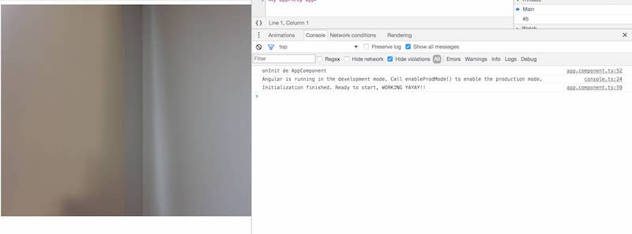

# Angular Systemjs and how to import Quagga 

this repo shows you how to import Quagga a javascirpt barcode reader into Angular with systemjs. 

feel free to open an issue. 

## Start project

simply run `npm start`

